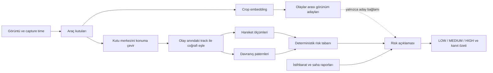

# Olay, hareket, risk ve araç görünüm analizi

Bu not, sistemin görüntü ve iz verisinden hangi ölçümleri çıkardığını ve bunları risk değerlendirmesinde nasıl kullandığını algoritmik açıdan açıklar. “Riskli araç bulma” ifadesi burada **üs çevresindeki hareket ve olay önceliğini inceleme** anlamındadır. Algoritmalar bir aracın düşman, suçlu veya saldırı niyetinde olduğunu belirlemez.

## Genel akış



Her hesapta değerlendirme zamanı olayın `capture_time` değeridir. Olaydan sonraki iz noktaları ve raporlar analiz anına geriye doğru sızdırılmaz.

## 1. Görüntüde araç tespiti

Tespit adımı görüntüdeki nesneler için sınıf, güven skoru ve piksel bounding box üretir. Gerçek model modunda model çıktısı araç sınıfları ve confidence eşiğiyle filtrelenir. Veri seti demo modunda ise tespit modeli çalıştırılmaz; kayıtlı `ground_truth.json` kutuları görüntü boyutuna ölçeklenerek kullanılır. Bu nedenle mock/ground-truth demo çıktısı, modelin canlı görüntü başarım ölçümü değildir. Karşılama ekranındaki simülasyon da önceden hesaplanmış olay sonuçlarını oynatır; canlı tespit veya risk pipeline'ı değildir.

Bir kutunun merkezi `(x1+x2)/2, (y1+y2)/2` sonraki konum hesabında aracın temsil noktasıdır. Sistem plaka OCR, super-resolution veya yeni kamera kaynağı kullanmaz.

## 2. Piksel koordinatından coğrafi konuma

İki georeferans yolu vardır:

1. **Katalog/köşe koordinatlı görüntü:** Kuşbakışı ve ortorektifiye görüntü varsayımıyla enlem ve boylam ayrı ayrı doğrusal enterpole edilir:

   ```text
   lon = üst_sol.lon + x / image_width  * (üst_sağ.lon - üst_sol.lon)
   lat = üst_sol.lat + y / image_height * (alt_sol.lat - üst_sol.lat)
   ```

   Alt-sağ köşe bu formülde kullanılmaz.

2. **Drone kamera parametreleri:** Piksel ışını kamera heading, gimbal açısı, yatay FOV ve AGL irtifasıyla zemine izdüşürülür. Işın zemine ulaşmıyorsa konum üretilemez. Kamera modeli düz zemin varsayar.

Bu konumlar sonraki mesafe ve hareket hesaplarının girdisidir; koordinat kalitesi doğrudan bu varsayımlara bağlıdır.

## 3. Tespit ile track eşlemesi

Olay akışında coğrafi tespit, capture anındaki iz noktalarıyla eşleştirilir. Önce capture zamanıyla 1 saniyeden az farkı olan track noktaları aday alınır; hiçbir track için böyle bir nokta bulunmazsa sınırlı enterpolasyon/ekstrapolasyon yedeği kullanılır. Tespit-track çiftleri mesafeye göre sıralanır ve açgözlü, birebir atama yapılır. Varsayılan mesafe kapısı 15 metredir; kapı dışındaki tespit eşleşmemiş kalır.

Eşleşmeyen nesne hata sayılmaz. Park etmiş araç, düşük güvenli tespit veya yetersiz iz nedeniyle hareket verisi bulunmuyor olabilir. Bu nesneler “zararsız” kabul edilmez; yalnızca hareket tabanlı risk kuralına sokulamaz ve veri boşluğu olarak raporlanır.

Eski canlı/demo tracker yolu farklıdır: yeni noktaları son konum ve sınırlı sabit-hız tahminiyle yakındaki izlere bağlar; mesafe kapısı geçen adaylardan en yakın olanları birebir atar. Bu, olay görüntülerindeki capture-time track eşlemesiyle aynı algoritma değildir.

## 4. Hareket analizi

Araç izi zaman sıralı coğrafi noktalardan oluşur. Analiz olay zamanına kadar olan son noktaları kullanır; son nokta en fazla 200 noktaya kesilir. Hız penceresi, iz örnekleme sıklığına göre seçilir: varsayılan en az 120 saniye ve medyan örnek aralığının yaklaşık 3,5 katı. Böylece seyrek örneklenen izlerde yalnızca birkaç saniyelik pencereye sıkışılmaz. İki noktadan az varsa hareket verisi yetersizdir.

Noktalar yerel doğu-kuzey metre koordinatlarına çevrilir ve `x(t)=a+vx·t`, `y(t)=b+vy·t` doğruları en küçük karelerle uydurulur. Hız vektörü `(vx, vy)` olur:

```text
speed = sqrt(vx² + vy²)
heading = atan2(vx, vy)
```

Üse doğru **radyal kapanma hızı**, hız vektörünün son konumdan üs merkezine bakan birim vektöre izdüşümüdür. Varsayılan eşik 0,8 m/s olduğunda araç `approaching=true` sayılır. Bu, yönün her adımda doğrudan üsse baktığını söylemez; toplam uydurulmuş hareketin üs yönündeki bileşenidir.

Üs sınırına kalan süre:

```text
ETA = max(0, mesafe_merkez - üs_yarıçap) / kapanma_hızı / 60
```

Yaklaşmıyorsa ETA üretilmez. Son iz noktası capture anından varsayılan 15 dakikadan eskiyse `stale` işaretlenir. Eski veya seyrek iz belirsizliği ortadan kaldırmaz; güven ve açıklamada veri boşluğu olarak görünür.

## 5. Davranış paternleri

Patern sınıflandırması kurallıdır; LLM kullanmaz. Bir iz seyrek örnekleniyorsa yaklaşma ve convoy pencereleri örnek aralığına göre büyütülür. Dönüşte tüm eşleşen paternler saklanır; tek bir özet etiket seçilmesi bilgi kaybını önlemek için detay listesinin yerini almaz.

| Patern | Varsayılan karar ölçütü |
|---|---|
| `LOITERING` | Son 2 saatte en az 10 nokta; gözlem en az pencerenin yarısı kadar sürmüş olmalı. Noktaların merkezden uzaklıklarının %98 persentili 200 m’den küçük olmalı. |
| `DIRECT_APPROACH` | Son 300 saniyede en az 5 nokta; üs merkezine mesafe en az 150 m kapanmalı; ardışık mesafeler GPS toleransı 15 m dışında artmamalı; anlamlı hareket segmentlerinin üs yönüne ortalama açısal sapması 15°’den küçük olmalı. |
| `CONVOY` | En az iki araç, aynı örnek zamanlarında 500 m içinde; hızları en az 1 m/s; yön farkı 20°’den küçük; hız farkı büyük hıza oranla en çok %35. Bu koşullar geçerli örneklerin en az %80’inde ve en az 5 örnekte sağlanmalı. |
| `RANDOM` | Yukarıdaki paternlerden hiçbiri eşleşmedi. “Rastgele” etiketi, düşmanlık veya zararsızlık hükmü değildir. |

Convoy hesabında izler ortak zaman noktalarında enterpole edilir; iz kapsamı dışına ekstrapolasyon yapılmaz. Birbirine uyan araç çiftleri geçici hareket grupları oluşturabilir. Bu grup aynı araç oldukları anlamına gelmez; yalnızca birlikte hareket ölçütlerinin karşılandığını gösterir.

Özet önceliği `CONVOY > DIRECT_APPROACH > LOITERING > RANDOM` biçimindedir. Birden fazla patern `matched_patterns` içinde tutulabilir.

## 6. Olaylar arası araç görünüm adayları (ReID evidence)

Her izli tespit crop’undan frozen ImageNet-pretrained MobileNetV3-Small ile 576 boyutlu özellik çıkarılır ve L2 normalize edilir. Bu backbone araç kimliği için özel eğitilmiş ReID modeli değildir. Crop boyutu, alan oranı ve kenar tabanlı keskinlik bir kalite özeti olarak saklanır; varsayılan karar akışında bu kalite puanı benzerlik skoruna çarpan olarak eklenmez. Çok küçük crop’lar embedding dışında bırakılır.

İki ayrı event’in embedding’leri arasında kosinüs benzerliği hesaplanır:

```text
similarity(a,b) = dot(a,b) / (||a|| · ||b||)
```

Varsayılan candidate koşulları:

- event ID’leri farklı olmalı;
- görünüm benzerliği en az `0.82` olmalı;
- capture zamanları arasında en çok `7.200` saniye (2 saat) bulunmalı;
- iki konum varsa düz çizgi mesafesi / zaman farkı en çok `70 m/s` olmalı;
- her track ucunda en fazla iki bağlantı tutulmalı (`top-K=2`).

Kabul edilen adaylar görünüm skoru yüksek, zaman farkı düşük olacak şekilde sıralanır. Link yönü capture zamanına göre eskiden yeniye kurulur; olayların araştırılma sırası bu yönü değiştirmez. Aynı event/track tekrar işlendiğinde önceki gözlem yenilenir. Koordinat eksikse spatial kontrol yapılmış sayılmaz; `spatial_checked=false` olarak açıklanır. Düz çizgi filtresi yol/topoloji erişilebilirliği hesaplamaz.

İlişki etiketi daima `POSSIBLE_SAME_VEHICLE` olur. Track ID, olaylar ve görüntüler arasında tek başına kalıcı kimlik kanıtı değildir. A→B ve B→C candidate edge’leri A, B ve C’yi bir identity kümesinde birleştirmez. Bu katman risk skorunu yükseltmez; risk ajanına yalnızca sınırlı bir kanıt bağlamı olarak verilir.

ReID gözlem indeksi gateway çalışma belleğindedir ve en fazla 500 gözlem tutar. Süreç yeniden başlayınca indeks yeniden kurulur; geçmiş candidate’lar kalıcı identity deposu değildir.

## 7. Risk kademesi ve kanıt ağırlığı

Hareketten her izli araç için kademe çıkarılır. En yüksek araç kademesi kendi-veri tabanıdır:

- `HIGH`: araç üs sınırında/içinde veya yaklaşma ETA’sı en çok 10 dakika;
- `MEDIUM`: yaklaşma var ve üs merkezine en çok 5 km uzakta ya da ETA en çok 30 dakika; yaklaşmasa bile üs yarıçapının iki katı içinde bekliyorsa da en az `MEDIUM`;
- `LOW`: uzak veya yaklaşmayan hareket. Veri yokluğu ayrıca işaretlenir; düşük kademe “tehdit yok” kanıtı değildir.

Patern, tabanı yukarı çekebilir: `DIRECT_APPROACH` en az `MEDIUM`; üsse 5 km içinde `LOITERING` en az `MEDIUM`; `CONVOY` normalde bir kademe yükseltir, convoy ile birlikte yaklaşma veya direct approach varsa `HIGH` olur. Bunlar kod düzeyinde deterministik kurallardır.

LLM etkinse hareket, patern ve bağlamı açıklama ve kanıt özeti üretmek için kullanır. Nihai kademesi deterministik kendi-veri tabanının altına inemez ve en fazla bir kademe üstüne çıkabilir. Kendi veri tabanı `LOW` iken dış istihbarat veya raporlar tek başına en çok `MEDIUM` sonucuna katkı verebilir. LLM kapalıysa, bütçe biterse veya yanıt protokolü başarısız olursa aynı taban kural motoruyla değerlendirilir.

Kaynak güveni algoritmik olarak atanır: detection/movement/pattern yüksek; drone orta; istihbarat ve raporlar düşük güvenlidir. Düşük güvenli kaynakların evidence breakdown içindeki toplam ağırlığı %20 ile sınırlanır ve ağırlıklar 1’e normalize edilir. Ağırlık, kaynakların göreli sunum payıdır; olasılık veya model doğruluğu değildir.

Saha raporlarındaki zaman, konum, araç tipi, sayı ve hareket iddiaları varsa olayın kendi tespit ve izleriyle nicel karşılaştırılır. Uyuşmayan iddia yerine sistemin kendi ölçümü esas alınır. Kimlik, “dost unsur” ve renk iddiaları kendi görüntü sınıfı/iz verisiyle doğrulanamaz; risk düşürmek için kullanılmaz.

## 8. Algoritmaların söylemediği şeyler

- Candidate ReID “aynı araç” sonucu değildir; görünüm benzerliğidir.
- Track eşleşmesi veya aynı ID, tek başına gerçek dünyada hukuki/kalıcı kimlik doğrulamaz.
- `approaching`, düz çizgide üs yönünde hız bileşenini ifade eder; gerçek rota veya niyet çıkarmaz.
- `CONVOY`, yakınlık ve eşzamanlı hareket benzerliğidir; organize saldırı grubu anlamına gelmez.
- `LOW`, “güvenli” veya “zararsız” demek değildir. İz yokluğu da düşük tehdidi kanıtlamaz.
- Sentetik ground-truth demo verisiyle ölçülen sonuçlar canlı dedektör başarımı veya ReID doğruluk metriği değildir. Araç kimliği ground truth’u olmadan ReID precision/recall iddiası üretilmez.
